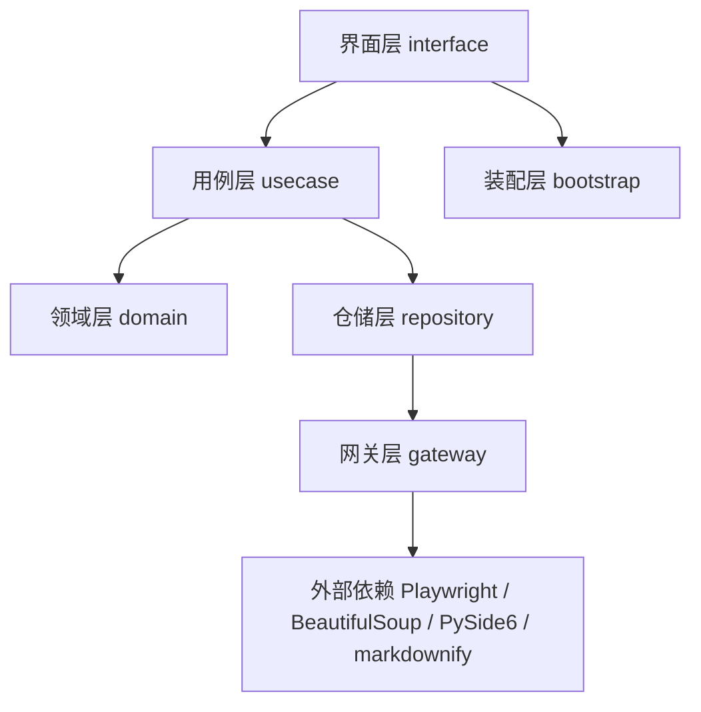
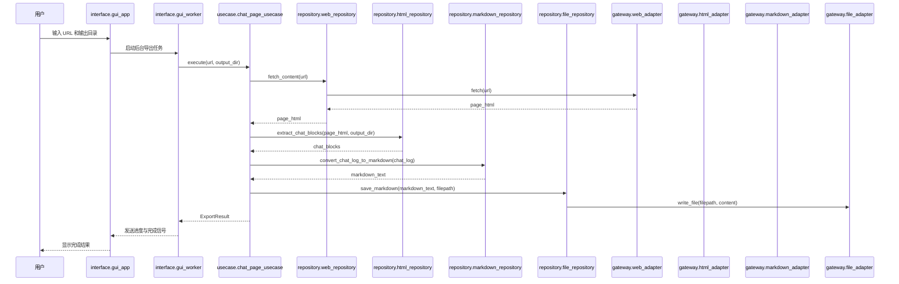

# deepwiki-to-md-gui 开发文档

## 1. 项目概述

`deepwiki-to-md-gui` 是一个用于导出 DeepWiki 内容的桌面图形化工具。

项目目标是将 DeepWiki 上的两类内容导出到本地 Markdown 文件中：

1. 仓库解读文档（Wiki）
2. 用户会话记录（Chat）

本 fork 版本以 **Windows 桌面 GUI 使用体验** 为核心，不再以 Docker 或命令行工具作为主要交付方式。

---

## 2. 架构设计

### 2.1 架构目标

本项目采用分层设计，核心目标如下：

- 将界面逻辑与业务逻辑解耦
- 让 GUI 层尽可能薄
- 让抓取、解析、导出逻辑可单独测试
- 降低未来替换 GUI 框架或网页抓取实现的成本
- 保持 chat / wiki 两条导出链路在结构上统一

### 2.2 分层结构



### 2.3 各层职责

| 层级 | 目录 | 职责 |
|------|------|------|
| 界面层 | `src/interface` | 提供 GUI 入口、后台任务线程、日志显示、用户输入处理 |
| 用例层 | `src/usecase` | 组织 chat/wiki 导出流程，协调仓储层与领域层 |
| 领域层 | `src/domain` | 定义核心实体、URL 解析规则、导出结果模型 |
| 仓储层 | `src/repository` | 连接业务逻辑与具体实现，负责数据转换与流程拼装 |
| 网关层 | `src/gateway` | 封装 Playwright、文件系统、Markdown 转换等外部能力 |

---

## 3. 目录结构

### 3.1 当前目录结构

```text
src/
├── domain/
│   ├── __init__.py
│   ├── constants.py
│   ├── entities.py
│   ├── export_models.py
│   └── url_parser.py
│
├── gateway/
│   ├── __init__.py
│   ├── web_adapter.py
│   ├── html_adapter.py
│   ├── markdown_adapter.py
│   └── file_adapter.py
│
├── repository/
│   ├── __init__.py
│   ├── web_repository.py
│   ├── html_repository.py
│   ├── markdown_repository.py
│   └── file_repository.py
│
├── usecase/
│   ├── __init__.py
│   ├── chat_page_usecase.py
│   └── wiki_site_usecase.py
│
└── interface/
    ├── __init__.py
    ├── bootstrap.py
    ├── gui_worker.py
    └── gui_app.py
```

### 3.2 关键文件说明

- `src/interface/gui_app.py`
  - GUI 主窗口入口
  - 负责输入 URL、选择输出目录、显示日志、展示结果
- `src/interface/gui_worker.py`
  - 在后台线程中执行导出任务
  - 防止 Playwright 抓取过程阻塞主线程
- `src/interface/bootstrap.py`
  - 统一组装 adapter / repository / usecase
  - 避免 GUI 层直接依赖底层实现细节
- `src/domain/url_parser.py`
  - 统一识别 DeepWiki URL 类型
  - 自动判断是 `chat` 还是 `wiki`
- `src/domain/export_models.py`
  - 定义 `ExportResult`、`ProgressEvent` 等结构化模型
- `src/usecase/chat_page_usecase.py`
  - 负责 Chat 导出业务流程
- `src/usecase/wiki_site_usecase.py`
  - 负责 Wiki 导出业务流程

---

## 4. 主要数据流

### 4.1 Chat 导出流程



### 4.2 Wiki 导出流程

Wiki 导出和 Chat 类似，但会多出一个“导航解析 + 多页面抓取”过程：

1. 访问 Wiki 首页
2. 提取导航链接
3. 逐页抓取和解析
4. 导出每个页面的 Markdown
5. 生成 `index.md`
6. 返回最终导出结果

---

## 5. 核心设计约定

### 5.1 GUI 只负责界面，不负责业务实现

GUI 层只做这些事：

- 接收用户输入
- 启动后台任务
- 展示日志和结果
- 提供“打开输出目录”等交互动作

GUI 层不应负责：

- URL 解析规则
- 页面抓取细节
- HTML 结构解析
- Markdown 拼装
- 文件命名和输出路径规则

这些能力应保留在 `domain`、`usecase`、`repository`、`gateway` 中。

### 5.2 URL 识别统一放在 `url_parser.py`

不要在 GUI、usecase、adapter 中重复解析 URL。  
统一通过 `parse_deepwiki_url(url)` 得到：

- 模式：`chat` / `wiki`
- chat id
- organization / repository

这样可以保证：

- GUI 的模式识别逻辑和业务执行逻辑一致
- 后续修改 URL 规则时只改一个地方

### 5.3 进度和结果必须结构化

不要依赖零散的 `print` 文本传递状态。  
导出流程对 GUI 的反馈应通过结构化模型完成：

- `ProgressEvent`
- `ExportResult`

这样 GUI 才能稳定显示：

- 当前进度
- 错误信息
- 输出目录
- 导出文件数量

### 5.4 后台执行必须与主线程分离

Playwright 页面抓取属于耗时操作。  
如果直接在 GUI 主线程里运行，会导致窗口卡死。

因此约定：

- GUI 主线程只负责界面更新
- 导出任务统一放在 `gui_worker.py` 中执行
- 后台线程通过 Qt Signal 向主窗口回传状态

---

## 6. 关键模块说明

### 6.1 `domain`

#### `entities.py`
保存领域实体，包括：

- `MermaidDiagram`
- `ChatBlockContent`
- `ChatLog`
- `WikiPage`
- `WikiSite`

这些对象用于表达业务语义，而不是用户界面语义。

#### `export_models.py`
用于定义导出过程中的结构化模型，例如：

- `ProgressEvent`
- `ExportResult`
- `ProgressReporter`

这是 GUI 和业务层之间的重要桥梁。

#### `url_parser.py`
负责识别：

- `https://deepwiki.com/search/...` 为 Chat
- `https://deepwiki.com/<org>/<repo>` 为 Wiki

### 6.2 `gateway`

#### `web_adapter.py`
- 使用 Playwright 加载页面
- 等待动态内容渲染完成
- 返回页面 HTML

#### `html_adapter.py`
- 使用 BeautifulSoup 解析 HTML
- 提取 chat block
- 提取 wiki 导航
- 提取 Mermaid 图
- 生成图像占位符

#### `markdown_adapter.py`
- 使用 `markdownify` 将 HTML 转换为 Markdown

#### `file_adapter.py`
- 创建目录
- 写入文件
- 回传保存状态

### 6.3 `repository`

仓储层对外暴露更稳定的操作接口，避免上层直接依赖第三方库实现细节。

例如：

- `WebRepository.fetch_content`
- `HtmlRepository.extract_chat_blocks`
- `MarkdownRepository.convert_chat_log_to_markdown`
- `FileRepository.save_markdown`

### 6.4 `usecase`

#### `chat_page_usecase.py`
负责：

1. 解析 chat URL
2. 建立输出目录
3. 拉取页面
4. 提取 chat block
5. 转换为 Markdown
6. 落盘保存
7. 返回 `ExportResult`

#### `wiki_site_usecase.py`
负责：

1. 解析 wiki URL
2. 建立输出目录
3. 拉取 Wiki 首页
4. 提取页面导航
5. 逐页抓取和导出
6. 生成 `index.md`
7. 返回 `ExportResult`

### 6.5 `interface`

#### `bootstrap.py`
统一组装依赖：

- adapter
- repository
- usecase

这样 GUI 层不需要知道底层对象如何初始化。

#### `gui_worker.py`
负责后台执行流程，包括：

- 创建独立 asyncio 运行环境
- 调用 usecase
- 发送进度信号
- 发送完成或失败信号

#### `gui_app.py`
负责：

- 构建界面
- 展示输入控件
- 展示日志区
- 调用 worker
- 显示最终导出结果

---

## 7. 开发环境

### 7.1 基础要求

建议环境：

- Python 3.12
- Windows 10 / Windows 11
- PowerShell
- 已安装 Git

### 7.2 安装依赖

```bash
python -m pip install -e .
python -m playwright install chromium
```

### 7.3 启动 GUI

```bash
python -m src.interface.gui_app
```

如果已经配置 GUI 启动入口，也可以使用：

```bash
deepwiki-to-md-gui
```

---

## 8. 打包与发布

### 8.1 Windows 打包

项目使用 `scripts/build_windows.ps1` 构建 Windows GUI 可执行程序。

执行方式：

```powershell
powershell -ExecutionPolicy Bypass -File .\scripts\build_windows.ps1
```

### 8.2 打包原则

当前推荐使用：

- `PyInstaller`
- `--onedir`

不建议首版就强行做单文件 exe，原因包括：

- Playwright/Chromium 资源较重
- 调试困难
- 更容易出现运行环境兼容问题

### 8.3 发布物建议

建议发布整个目录：

```text
dist\DeepWikiExporter\
```

而不是只发布单个 exe 文件。

---

## 9. 测试策略

当前仓库以 GUI-only 形态维护，现阶段主要保留 S 级和 M 级测试。

### 9.1 测试目标

测试的重点不是“GUI 按钮有没有长出来”，而是：

- URL 是否能正确识别模式
- chat/wiki 导出逻辑是否正确
- Mermaid 图是否能被正确保存
- 输出文件路径与内容是否符合预期
- 进度和结果模型是否稳定

### 9.2 推荐测试分层

#### S 级测试（单元测试）
当前仓库已包含这一级测试，适合测试：

- `url_parser.py`
- `export_models.py`
- `entities.py` 中纯逻辑方法

#### M 级测试（集成测试）
当前仓库已包含这一级测试，适合测试：

- `bootstrap.py`
- usecase 与 repository 的联动
- 文件输出路径生成逻辑

#### L 级测试（端到端测试）
这一级测试目前可作为后续扩展方向，适合测试：

- 实际访问 DeepWiki 页面
- 导出 Markdown 与 SVG 文件
- 快照比对

当前仓库默认不再依赖旧的 CLI 测试脚本。

### 9.3 GUI 测试建议

GUI 本身首版建议只做轻量验证：

- 窗口能否启动
- 输入 URL 后是否能识别模式
- 点击导出后是否能收到完成信号
- 日志区是否能显示进度消息

不要在早期把大量测试精力投入到控件像素级验证上。

---

## 10. 常见开发注意事项

### 10.1 不要把业务逻辑写进 GUI

如果你发现自己在 `gui_app.py` 里开始处理：

- URL 分支判断
- 页面抓取细节
- 输出目录规则
- Markdown 内容拼装

说明职责已经越界，需要回收到底层模块。

### 10.2 不要在多个地方重复解析 URL

所有 URL 识别规则必须收口到 `url_parser.py`。

### 10.3 不要让 adapter 层直接决定界面行为

adapter 层只能发出结构化进度或异常，不能直接依赖 GUI 组件。

### 10.4 修改 HTML 解析规则时要留意兼容性

DeepWiki 页面结构可能会变化。  
当页面解析失效时，优先检查：

- chat block 选择器
- wiki 导航选择器
- Mermaid 图提取选择器

通常这类问题发生在：

- `html_adapter.py`
- `html_repository.py`

---

## 11. 扩展方向

未来如果继续扩展，本项目比较适合沿以下方向演进：

### 11.1 导出结果预览
在 GUI 中增加导出结果预览能力，例如：

- 导出成功后显示 Markdown 文件列表
- 支持点击后打开文件
- 支持快速预览生成内容

### 11.2 导出任务历史记录
保存历史导出记录，例如：

- 最近导出的 URL
- 最近的输出目录
- 最近一次导出时间

### 11.3 可配置导出规则
未来可以增加 GUI 设置项，例如：

- 是否覆盖已有输出
- 是否保留原始 HTML
- 是否启用更严格的文件命名规则

### 11.4 更完善的错误诊断
未来可以增加：

- 错误分类提示
- 网络异常提示
- 页面结构变化提示
- Chromium 缺失提示

---

## 12. 开发工作流建议

推荐开发顺序如下：

1. 先改业务层和导出流程
2. 再补结构化进度与结果模型
3. 然后再接入 GUI
4. 最后处理打包脚本与文档

如果某次修改涉及页面解析规则，优先验证：

1. chat 导出是否仍正常
2. wiki 导出是否仍正常
3. Mermaid 图是否仍能保存
4. GUI 是否仍能收到正确完成状态

---

## 13. 维护说明

本项目依赖 DeepWiki 页面结构。  
如果 DeepWiki 前端结构发生变化，最容易受影响的模块是：

- `src/gateway/html_adapter.py`
- `src/repository/html_repository.py`

如果出现“页面能打开但导出为空”这类问题，优先从这两层开始排查，而不是先怀疑 GUI。

---

## 14. 总结

`deepwiki-to-md-gui` 的核心思路是：

- 用 GUI 提升使用体验
- 用分层设计保持核心逻辑可维护
- 用结构化结果和进度桥接界面与业务
- 用后台线程保证 Playwright 导出过程不阻塞界面

只要继续保持“GUI 薄、业务稳、解析集中”的原则，后续扩展成本会低很多。
