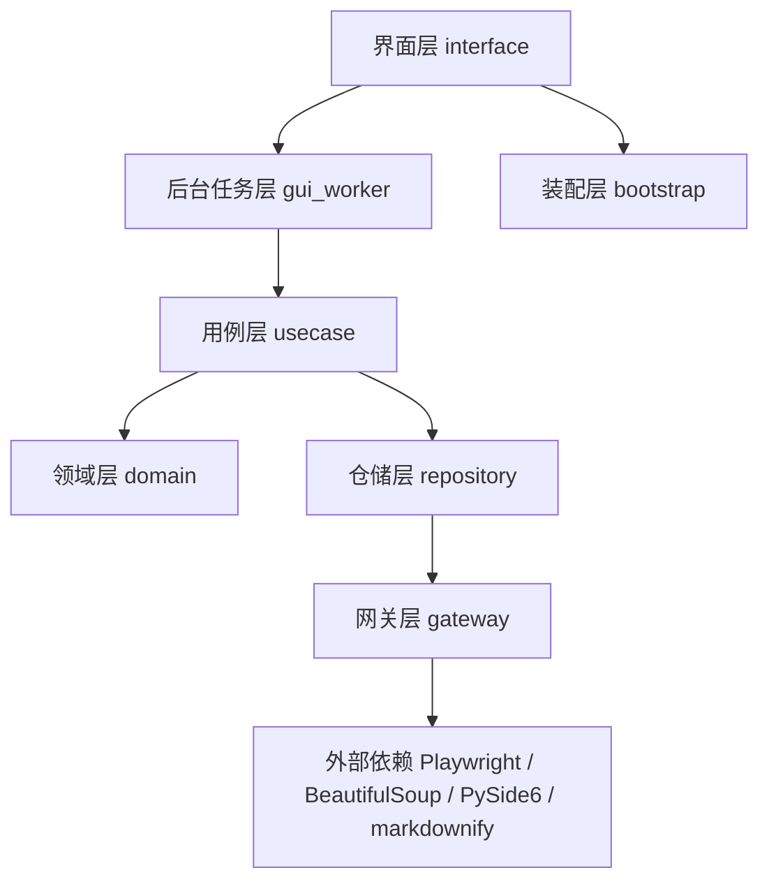
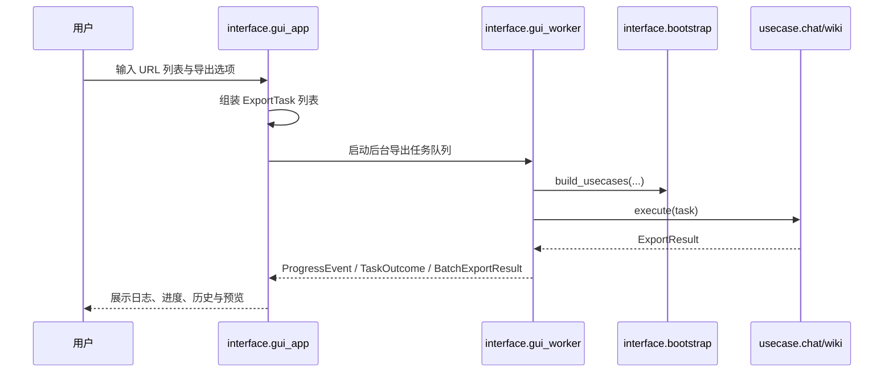
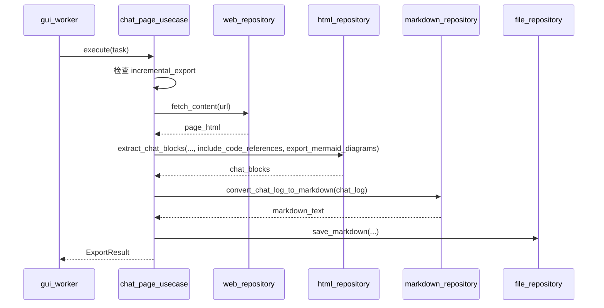

# deepwiki-to-md-gui 开发文档

## 1. 项目概述

`deepwiki-to-md-gui` 是一个用于导出 DeepWiki 内容的桌面图形化工具。

项目目标是把 DeepWiki 上的两类内容导出到本地 Markdown 文件中：

1. 仓库解读文档（Wiki）
2. 用户会话记录（Chat）

本 fork 版本以 **Windows 桌面 GUI 使用体验** 为核心，不再以 Docker 或命令行工具作为主要交付方式。

当前版本已经支持：

- 批量 URL 队列导出
- 结构化进度回传
- 取消导出与失败重试
- 历史记录和 Markdown 预览
- 环境自检
- 导出选项面板
- Wiki 页面筛选
- 增量导出
- 合并版 Wiki 文档

---

## 2. 架构设计

### 2.1 架构目标

本项目采用分层设计，核心目标如下：

- 将界面逻辑与业务逻辑解耦
- 让 GUI 层尽可能薄
- 让抓取、解析、导出逻辑可单独测试
- 降低未来替换 GUI 框架或网页抓取实现的成本
- 保持 chat / wiki 两条导出链路在结构上统一
- 让任务级导出选项和队列控制贯穿整个调用链

### 2.2 分层结构



### 2.3 各层职责

| 层级 | 目录 | 职责 |
|------|------|------|
| 界面层 | `src/interface` | GUI 入口、导出选项、页面筛选、历史记录、预览、自检 |
| 后台任务层 | `src/interface/gui_worker.py` | 队列调度、取消控制、逐任务结果汇总 |
| 用例层 | `src/usecase` | 组织 chat/wiki 导出流程，处理增量导出和页面选择 |
| 领域层 | `src/domain` | 定义实体、任务模型、导出结果、URL 规则、取消令牌 |
| 仓储层 | `src/repository` | 连接业务逻辑与具体实现，负责内容提取和 Markdown 生成 |
| 网关层 | `src/gateway` | 封装 Playwright、文件系统、Markdown 转换等外部能力 |

---

## 3. 目录结构

### 3.1 当前目录结构

```text
src/
├── domain/
│   ├── __init__.py
│   ├── constants.py
│   ├── entities.py
│   ├── export_models.py
│   └── url_parser.py
│
├── gateway/
│   ├── __init__.py
│   ├── web_adapter.py
│   ├── html_adapter.py
│   ├── markdown_adapter.py
│   └── file_adapter.py
│
├── repository/
│   ├── __init__.py
│   ├── web_repository.py
│   ├── html_repository.py
│   ├── markdown_repository.py
│   └── file_repository.py
│
├── usecase/
│   ├── __init__.py
│   ├── chat_page_usecase.py
│   └── wiki_site_usecase.py
│
└── interface/
    ├── __init__.py
    ├── bootstrap.py
    ├── gui_worker.py
    └── gui_app.py
```

### 3.2 关键文件说明

- `src/interface/gui_app.py`
  - GUI 主窗口入口
  - 管理 URL 队列、导出选项、Wiki 页面筛选、历史记录、预览和自检
- `src/interface/gui_worker.py`
  - 在后台线程中执行导出任务队列
  - 汇总 `TaskOutcome` 和 `BatchExportResult`
- `src/interface/bootstrap.py`
  - 统一组装 adapter / repository / usecase
  - 将取消令牌和进度上下文注入到导出链路
- `src/domain/export_models.py`
  - 定义 `ExportTask`、`ExportOptions`、`ExportResult`、`ProgressEvent`
- `src/usecase/chat_page_usecase.py`
  - 负责 Chat 导出和 Chat 的增量复用策略
- `src/usecase/wiki_site_usecase.py`
  - 负责 Wiki 导出、导航发现、页面筛选、增量导出、目录页和合并文档

---

## 4. 主要数据流

### 4.1 队列导出总流程



### 4.2 Chat 导出流程



### 4.3 Wiki 导出流程

Wiki 导出现在包含额外的策略步骤：

1. 访问 Wiki 首页
2. 提取导航链接
3. 根据 `selected_wiki_page_urls` 过滤页面
4. 根据 `incremental_export` 决定是否复用已有页面 Markdown
5. 导出每个页面
6. 按选项决定是否生成 `index.md`
7. 按选项决定是否生成合并版 `wiki.md`
8. 返回 `ExportResult`

---

## 5. 核心设计约定

### 5.1 GUI 负责交互编排，不负责导出业务规则

GUI 层可以负责：

- 接收用户输入
- 组装 `ExportTask`
- 管理导出选项
- 发起 Wiki 页面选择
- 启动后台任务
- 展示日志、历史和预览

GUI 层不应负责：

- URL 解析规则
- 页面抓取细节
- 增量导出规则
- Markdown 拼装
- Wiki 页面输出路径规则

这些能力应保留在 `domain`、`usecase`、`repository`、`gateway` 中。

### 5.2 所有任务级选项都通过 `ExportTask` 传递

不要在多个层之间散落布尔参数。  
当前统一通过：

- `ExportTask`
- `ExportOptions`
- `selected_wiki_page_urls`

来描述一次完整的导出任务。

这样可以保证：

- GUI、Worker、Usecase 使用同一份任务描述
- 历史记录可以完整恢复任务配置
- 批量导出和失败重试不丢失选项

### 5.3 进度、取消和结果必须结构化

导出流程对 GUI 的反馈统一通过结构化模型完成：

- `ProgressEvent`
- `ExportResult`
- `TaskOutcome`
- `BatchExportResult`
- `CancellationToken`

这样 GUI 才能稳定显示：

- 当前任务号
- 当前阶段
- 子项进度
- 跳过数量
- 预览文件

### 5.4 Wiki 页面筛选必须保持文件名稳定

选择性导出 Wiki 页面时，页面编号不能因为筛选而重新计算。  
当前实现会保留页面在原始导航中的序号，这样有两个好处：

- 文件名稳定
- 增量导出更可靠

### 5.5 增量导出优先复用现有 Markdown

当前增量策略比较保守：

- Chat：如果 `chat.md` 已存在，则直接复用
- Wiki：如果页面 Markdown 已存在，则复用页面文件
- 如果启用了合并版 Wiki，则会优先读取已有页面 Markdown 来重新拼接 `wiki.md`

这套策略避免重新抓取，但不做内容变更检测。  
如果未来要做更严格的增量机制，可以再引入页面 hash 或元数据索引。

---

## 6. 关键模块说明

### 6.1 `domain`

#### `entities.py`

保存领域实体，包括：

- `MermaidDiagram`
- `ChatBlockContent`
- `ChatLog`
- `WikiPage`
- `WikiSite`

#### `export_models.py`

用于定义导出过程中的结构化模型，例如：

- `ExportOptions`
- `ExportTask`
- `ProgressEvent`
- `ExportResult`
- `TaskOutcome`
- `BatchExportResult`
- `CancellationToken`

这是 GUI、Worker 和业务层之间的主要桥梁。

#### `url_parser.py`

负责统一识别：

- `https://deepwiki.com/search/...` 为 Chat
- `https://deepwiki.com/<org>/<repo>` 为 Wiki

### 6.2 `gateway`

#### `web_adapter.py`

- 使用 Playwright 加载页面
- 等待动态内容渲染完成
- 在关键阶段检查取消令牌
- 返回页面 HTML

#### `html_adapter.py`

- 使用 BeautifulSoup 解析 HTML
- 提取 chat block
- 提取 wiki 导航
- 提取 Mermaid 图
- 生成图像占位符

#### `markdown_adapter.py`

- 使用 `markdownify` 将 HTML 转换为 Markdown

#### `file_adapter.py`

- 创建目录
- 写入文件
- 读取已有 Markdown
- 回传保存状态

### 6.3 `repository`

仓储层对外暴露更稳定的操作接口，避免上层直接依赖第三方库实现细节。

例如：

- `WebRepository.fetch_content`
- `HtmlRepository.extract_chat_blocks`
- `HtmlRepository.process_wiki_page_content`
- `MarkdownRepository.generate_wiki_index`
- `MarkdownRepository.generate_merged_wiki`
- `FileRepository.save_markdown`

### 6.4 `usecase`

#### `chat_page_usecase.py`

负责：

1. 解析 chat URL
2. 建立输出目录
3. 判断是否走增量复用
4. 拉取页面
5. 按选项提取 chat block
6. 转换为 Markdown
7. 落盘保存
8. 返回 `ExportResult`

#### `wiki_site_usecase.py`

负责：

1. 解析 wiki URL
2. 建立输出目录
3. 发现导航
4. 根据页面筛选条件过滤
5. 根据增量选项复用已有页面
6. 逐页抓取和导出
7. 根据选项生成 `index.md`
8. 根据选项生成 `wiki.md`
9. 返回 `ExportResult`

### 6.5 `interface`

#### `bootstrap.py`

统一组装依赖：

- adapter
- repository
- usecase
- cancellation token
- progress reporter context

#### `gui_worker.py`

负责后台执行流程，包括：

- 创建独立 asyncio 运行环境
- 执行任务队列
- 调用 usecase
- 汇总任务结果
- 发送进度、完成或失败信号

#### `gui_app.py`

负责：

- 构建界面
- 读取和保存导出选项
- 读取和保存 Wiki 页面过滤条件
- 管理历史记录
- 启动 Worker
- 显示最终导出结果和 Markdown 预览

---

## 7. 开发环境

### 7.1 基础要求

建议环境：

- Python 3.12
- Windows 10 / Windows 11
- PowerShell
- 已安装 Git

### 7.2 安装依赖

```bash
python -m pip install -e .
python -m playwright install chromium
```

### 7.3 启动 GUI

```bash
python -m src.interface.gui_app
```

如果已经配置 GUI 启动入口，也可以使用：

```bash
deepwiki-to-md-gui
```

---

## 8. 打包与发布

### 8.1 Windows 打包

项目使用 `scripts/build_windows.ps1` 构建 Windows GUI 可执行程序。

执行方式：

```powershell
powershell -ExecutionPolicy Bypass -File .\scripts\build_windows.ps1
```

### 8.2 打包原则

当前推荐使用：

- `PyInstaller`
- `--onedir`

不建议首版就强行做单文件 exe，原因包括：

- Playwright/Chromium 资源较重
- 调试困难
- 更容易出现运行环境兼容问题

---

## 9. 测试策略

当前仓库以 GUI-only 形态维护，现阶段主要保留 S 级和 M 级测试。

### 9.1 测试重点

测试重点不是“按钮有没有显示”，而是：

- URL 是否能正确识别模式
- 任务模型和导出选项是否稳定
- chat/wiki 导出逻辑是否正确
- 增量导出是否按预期跳过
- 合并版 Wiki 是否保持顺序和目录
- 进度和结果模型是否稳定

### 9.2 推荐测试分层

#### S 级测试（单元测试）

适合测试：

- `url_parser.py`
- `export_models.py`
- `markdown_repository.py`
- `entities.py` 中纯逻辑方法

#### M 级测试（集成测试）

适合测试：

- `bootstrap.py`
- usecase 与 repository 的联动
- 文件输出路径生成逻辑
- 增量导出行为

#### L 级测试（端到端测试）

后续可以扩展：

- 实际访问 DeepWiki 页面
- 导出 Markdown 与 SVG 文件
- 队列导出和取消操作
- 快照比对

### 9.3 GUI 测试建议

GUI 本身建议只做轻量验证：

- 窗口能否启动
- 输入 URL 后是否能识别模式
- 选项是否能持久化
- Wiki 页面选择是否能保存
- 点击导出后是否能收到完成信号
- 预览区是否能打开最新 Markdown

---

## 10. 常见开发注意事项

### 10.1 不要把抓取和导出规则写进 GUI

如果你发现自己在 `gui_app.py` 里开始处理：

- 页面抓取细节
- 增量导出判断
- Markdown 拼装
- 页面文件命名

说明职责已经越界，需要回收到底层模块。

### 10.2 不要在多个地方重复解析 URL

所有 URL 识别规则必须收口到 `url_parser.py`。

### 10.3 不要让 adapter 层直接决定界面行为

adapter 层只能发出结构化进度或异常，不能直接依赖 GUI 组件。

### 10.4 修改 HTML 解析规则时要留意兼容性

DeepWiki 页面结构可能会变化。  
当页面解析失效时，优先检查：

- chat block 选择器
- wiki 导航选择器
- Mermaid 图提取选择器

通常这类问题发生在：

- `html_adapter.py`
- `html_repository.py`

### 10.5 修改增量导出时要留意稳定文件名

增量导出依赖页面文件名稳定。  
如果修改了 `WikiPage.get_filename()` 或选择性导出的页码规则，需要同步验证：

1. 已有 Wiki 页面是否还能被正确复用
2. `wiki.md` 是否还能按预期拼接旧页面
3. 页面筛选前后文件名是否一致

---

## 11. 后续扩展方向

后续如果继续扩展，比较合适的方向包括：

### 11.1 更严格的增量检测

- 为每个页面保存 hash 或元数据
- 对比页面变化后再决定是否跳过

### 11.2 导出诊断包

- 导出失败时保存原始 HTML
- 保存页面选择和任务选项
- 方便排查 DeepWiki 页面结构变化

### 11.3 更细粒度的合并策略

- 允许只合并选中的部分页面
- 允许自定义合并顺序
- 允许为合并版添加 front matter

### 11.4 更完整的 GUI 自动化测试

- 使用 Qt 测试工具验证历史记录恢复
- 验证页面选择对话框
- 验证导出选项面板的状态恢复

---

## 12. 开发工作流建议

推荐开发顺序如下：

1. 先改 `domain` 和 `usecase`
2. 再补 `repository` / `gateway`
3. 然后再接入 `gui_worker`
4. 最后处理 `gui_app.py`、打包脚本和文档

如果某次修改涉及页面解析规则，优先验证：

1. chat 导出是否仍正常
2. wiki 导出是否仍正常
3. 页面筛选后的导出是否仍正常
4. Mermaid 图是否仍能保存或正确省略
5. 增量复用是否仍然可靠

---

## 13. 维护说明

本项目依赖 DeepWiki 页面结构。  
如果 DeepWiki 前端结构发生变化，最容易受影响的模块是：

- `src/gateway/html_adapter.py`
- `src/repository/html_repository.py`
- `src/usecase/wiki_site_usecase.py`

如果出现“页面能打开但导出为空”“页面选择后匹配不到页面”“合并版内容缺失”等问题，优先从这几层开始排查，而不是先怀疑 GUI。

---

## 14. 总结

`deepwiki-to-md-gui` 当前的核心思路是：

- 用 GUI 提升使用体验
- 用分层设计保持核心逻辑可维护
- 用任务模型统一导出选项和页面选择
- 用结构化结果和进度桥接界面与业务
- 用后台线程保证 Playwright 导出过程不阻塞界面

只要继续保持“GUI 负责交互编排、Usecase 负责导出策略、解析规则集中管理”的原则，后续扩展成本会低很多。
